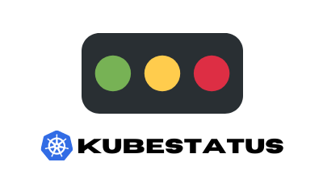
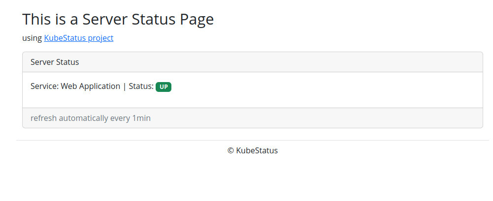

<p align="center">
  
</p>


**Kubestatus** is an free and open-source tool to easily add status page to your Kubernetes cluster that currently display the status (UP or DOWN) of services.It is written in Go and uses the Kubernetes API to fetch information about the clusters and resources.

The tool provides a simple and convenient way to view the current state of your cluster and resources without having to use the kubectl command-line tool or the Kubernetes dashboard and in the same time give you a costumer friendly page that can be used as you main status page.


### Features:

- ⚡ Lightweight
- 🔧 Zero configuration
- 📖 Open-source
- 📫 Support TCP and UDP services


### Installation
#### Using helm:

When you have helm installed in your machine, use the following setup:

```console
helm repo add kubestatus https://soub4i.github.io/kubestatus
```
```console
helm repo update
```

After install the chart

```console
helm install kubestatus kubestatus/kubestatus --set namespace="default" --n kubestatus --create-namespace --wait
```


You may also provide a values file instead:

```conosle
 helm show values kubestatus/kubestatus > ./kubestatus-values.yaml 
```

Edit the file `kubestatus-values.yaml`

```yaml
namespace: "default"
```

And use that:

```console
helm upgrade --install kubestatus kubestatus/kubestatus --values=kubestatus-values.yaml
```
#### Using kubectl:

Clone the repo:

```console
git clone https://github.com/soub4i/kubestatus
cd kubestatus
```
Create k8s resources:

```console
kubectl create -f kubestatus.yaml
```

### Configuration 


In order to spin up Kubestatus in a Kubernetes cluster quickly, You need to:

- Tell Kubestatus the namespace to watch for that edit `ConfigMap` and update `namespace` value
- Tell Kubestatus the services to watch for that add annotation `kubestatus/watch='true'` to desired services:

```console
kubectl annotate svc my-service-name kubestatus/watch='true'
```

### Example 

You created this web application based on nginx image.

```console
cat <<EOF | kubectl apply -f -
apiVersion: apps/v1
kind: Deployment
metadata:
  name: nginx-deployment
spec:
  selector:
    matchLabels:
      app: nginx
  replicas: 1
  template:
    metadata:
      labels:
        app: nginx
    spec:
      containers:
      - name: nginx
        image: nginx:1.14.2
        ports:
        - containerPort: 80
EOF
```

Exposing the web application using k8s service

```console
cat <<EOF | kubectl apply -f -
apiVersion: v1
kind: Service
metadata:
  name: web-service
spec:
  selector:
    app: nginx
  ports:
  - port: 80
EOF
```

Add annotation to `web-service`:

```console
kubectl annotate svc web-service kubestatus/watch='true'
```


In order to visit kubestatus status page you can `port-forword` the Kubestatus service:

```console
kubectl port-forward service/kubestatus-service 8080:8080 -n kubestatus
```

🚀 Now navigate to http://localhost:8080 you should see your status page like this:



### License

By contributing, you agree that your contributions will be licensed under its Apache License 2.0.