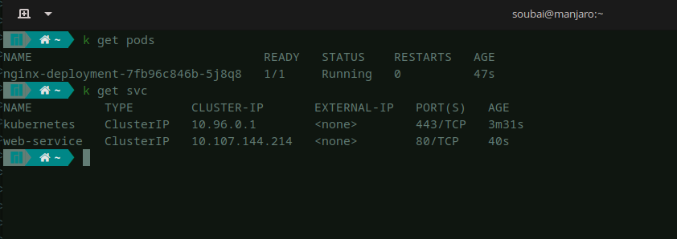
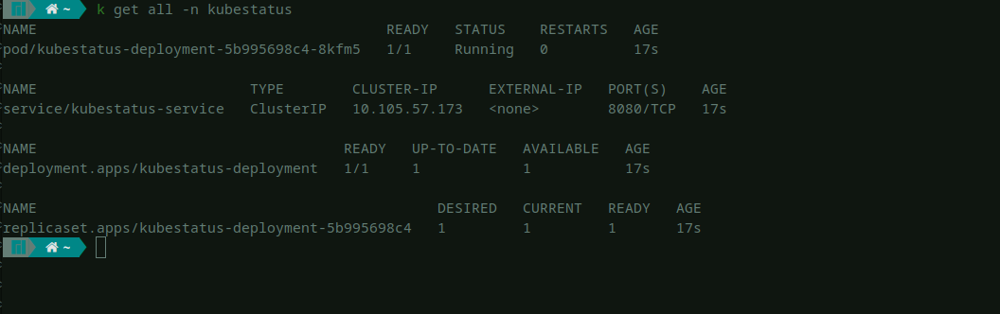
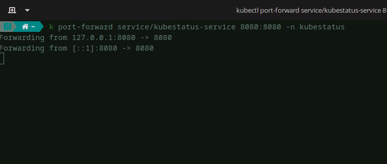

<p align="center">
  
</p>


**Kubestatus** is an free and open-source tool to easily add status page to your Kubernetes cluster that currently display the status (UP or DOWN) of services.It is written in Go and uses the Kubernetes API to fetch information about the clusters and resources.

The tool provides a simple and convenient way to view the current state of your cluster and resources without having to use the kubectl command-line tool or the Kubernetes dashboard and in the same time give you a costumer friendly page that can be used as you main status page.


### Cluster Installation
#### Using helm:
When you have helm installed in your cluster, use the following setup:

```console
helm repo add kubestatus https://soub4i.github.io/kubestatus
```
And
```console
helm install kubestatus kubestatus/kubestatus --set services="My super app=myservice-name.default;" --namespace kubestatus --create-namespace --wait
```

You may also provide a values file instead:

```conosle
 helm show values kubestatus/kubestatus > ./kubestatus-values.yaml 
```

Edit the file `kubestatus-values.yaml`

```yaml
services: "my-app=my-app-service.default;"
```

And use that:

```console
helm upgrade --install kubestatus kubestatus --values=kubestatus-values.yaml
```
#### Using kubectl:

Clone the repo:

```console
git clone https://github.com/soub4i/kubestatus
cd kubestatus
```
Create k8s resources:

```console
kubectl create -f kubestatus.yaml
```

In order to run Kubestatus in a Kubernetes cluster quickly, the easiest way is for you to update the `ConfigMap` section that will hold Kubestatus configuration.

An example is provided below , do not forget to update it to add your own services while respecting the follow format:

```
LABEL=SERVICE_NAME.NAMESPACE:HEALTH_CHECK_ENDPOINT;
```

- LABEL: is the name of the service that will be displayed in status page
- SERVICE_NAME: is Kubernetes service name
- HEALTH_CHECK_ENDPOINT: if defined the endpoint will be used by Kubestatus to check health of your service. Default value is **/**

Kubestatus support multiple service make sure you add a `;` after each definition

edit a `kubestatus.yaml`:

This configuration will create: 

 - kubestatus `Namespace`
 - kubestatus-deployment `Deployment`
 - kubestatus-service `Service`
 - kubestatus-config `ConfigMap`


### example 

You created this web application based on nginx image.

```console
cat <<EOF | kubectl apply -f -
apiVersion: apps/v1
kind: Deployment
metadata:
  name: nginx-deployment
spec:
  selector:
    matchLabels:
      app: nginx
  replicas: 1
  template:
    metadata:
      labels:
        app: nginx
    spec:
      containers:
      - name: nginx
        image: nginx:1.14.2
        ports:
        - containerPort: 80
EOF
```

Exposing the web application using k8s service

```console
cat <<EOF | kubectl apply -f -
apiVersion: v1
kind: Service
metadata:
  name: web-service
spec:
  selector:
    app: nginx
  ports:
  - port: 80
EOF
```



Update the `ConfigMap` in the [kubestatus.yaml](./kubestatus.yaml) file to look:


```yaml
kind: ConfigMap 
apiVersion: v1 
metadata:
  name: kubestatus-config
  namespace: kubestatus
data:
  services: |
    Web app=web-service.default;
```

apply the value file:

```console
kubectl create -f kubestatus.yaml
```



now Kubestatus is installed on your cluster let's `port-forword` the Kubestatus service so we can see the status page.


```console
kubectl port-forward service/kubestatus-service 8080:8080 
```




🚀 Now navigate to http://localhost:8080 you should see your status page like this:


### License

By contributing, you agree that your contributions will be licensed under its Apache License 2.0.